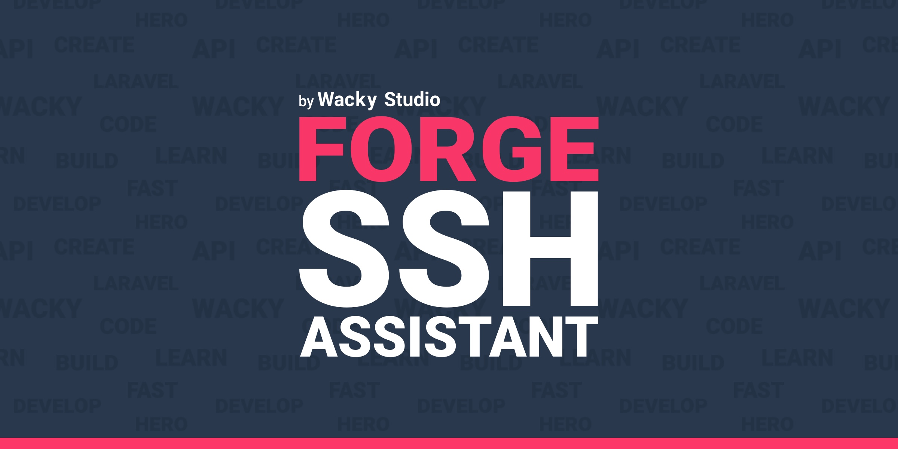

[](https://packagist.org/packages/wackystudio/forge-ssh-assistant)

Forge SSH Assistant is a CLI tool built with [Laravel Zero](https://laravel-zero.com) for macOS and Linux that fetches your Laravel Forge 
servers and lists these in a menu so you can easily choose which server you want to connect to using SSH.

With Forge SSH Assistant you don't have to open Laravel Forge to check the IP address of the server(s) you want to work with. 

You don't have to maintain aliases on every machine you use for development, all Forge SSH Assistant needs is a valid Laravel Forge token to be able to access your Laravel Forge account 
and fetch a list of your servers.

------

## Installation

You can install Forge SSH Assistant through Composer like this:

```bash
composer global require wackystudio/forge-ssh-assistant
```

This will install Forge SSH Assistant globally on your machine.
Make sure to add Composers global bin directory to your `$PATH` so the Forge SSH Assistant
can be accessed anywhere.

The Composer global bin directory is placed differently based on your operation system 
and some common locations are:
* macOS: `$HOME/.composer/vendor/bin`
* GNU / Linux Distributions: `$HOME/.config/composer/vendor/bin`

After the installation you will be able to run Forge SSH Assistant through the `forge` command.

### Adding a token
To be able to interact with your Laravel Forge account, Forge SSH Assistant needs a valid Laravel Forge token.

To create a token you'll need to head into your account settings on Laravel Forge and choose **API** in the menu.

Here you should create a new token, you can name it whatever you want but we recommend that you name it 
`Forge SSH Assisntant <computer-name>` where you replace the `<computer-name>` with the actual name of your computer, 
such as `Office` or `MacBook Pro`

An overlay will open with the actual token, which you should copy. Make sure that you copy everything.

Go into your terminal and run the following command and replace the ´<the-token-copied-from-laravel-forge>´ 
with the actual token you copied from Laravel Forge:
```bash
forge token:add <the-token-copied-from-laravel-forge>
```

To test that everything works, run the following command:
```bash
forge ssh
```
You should now be able to see the servers you have provisioned through Laravel Forge and select these to SSH into them.
## License

Forge SSH Assistant is an open-source software licensed 
under the [MIT license](https://raw.githubusercontent.com/WackyStudio/ForgeSSHAssistant/master/LICENSE.md).
